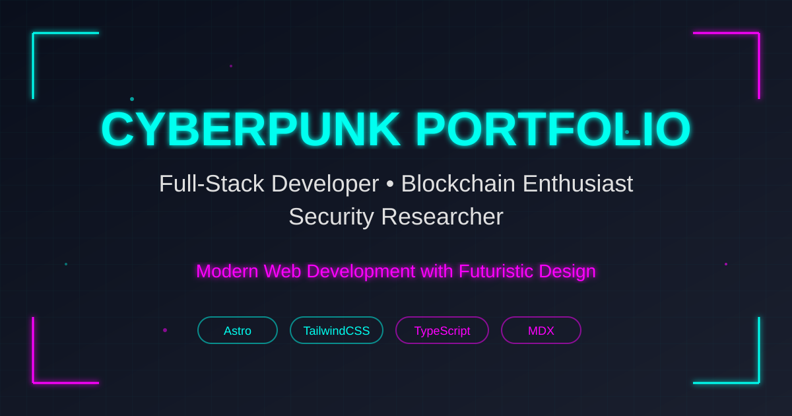

# 🌐 Cyberpunk Portfolio

A modern, futuristic portfolio website built with Astro, featuring cyberpunk aesthetics with neon glows, glassmorphism effects, and particle animations.



## ✨ Features

- 🎨 **Cyberpunk Design** - Neon cyan & magenta color scheme with futuristic aesthetics
- 🚀 **Astro Framework** - Lightning-fast static site generation
- 💨 **TailwindCSS v4** - Modern utility-first CSS framework
- 📝 **MDX Support** - Write blog posts and portfolio items in Markdown
- ✨ **Particle Effects** - Interactive background animations with tsparticles
- 🎭 **Glassmorphism** - Modern glass-effect UI components
- 📱 **Fully Responsive** - Optimized for all device sizes
- 🔍 **SEO Optimized** - Complete meta tags, Open Graph, and Twitter Cards
- 🎯 **Performance Focused** - Optimized for Core Web Vitals
- ♿ **Accessible** - WCAG compliant with semantic HTML
- 🌙 **PWA Ready** - Progressive Web App capabilities

## 🛠️ Tech Stack

- **Framework:** [Astro](https://astro.build/) v5.14.4
- **Styling:** [TailwindCSS](https://tailwindcss.com/) v4.1.14
- **Content:** [MDX](https://mdxjs.com/) for blog and portfolio
- **Animations:** [AOS](https://michalsnik.github.io/aos/) - Animate on Scroll
- **Particles:** [tsparticles](https://particles.js.org/)
- **TypeScript:** Full type safety
- **Package Manager:** npm/pnpm/yarn

## 📋 Prerequisites

- Node.js 18.0 or higher
- npm/pnpm/yarn package manager

## 🚀 Quick Start

### 1. Clone the repository

```bash
git clone https://github.com/ardipermana59/astro-cyberpunk.git
cd astro-cyberpunk
```

### 2. Install dependencies

```bash
npm install
# or
pnpm install
# or
yarn install
```

### 3. Setup environment variables

Copy the `.env.example` file to `.env` and update with your information:

```bash
cp .env.example .env
```

Edit `.env` with your personal information:

```env
# Personal Information
SITE_NAME="Your Name"
SITE_TITLE="Your Portfolio Title"
SITE_DESCRIPTION="Your description"
SITE_URL="https://yourdomain.com"

# Contact
EMAIL="your@email.com"

# Social Media
GITHUB_URL="https://github.com/yourusername"
INSTAGRAM_URL="https://instagram.com/yourusername"
LINKEDIN_URL="https://linkedin.com/in/yourusername"

# ... (see .env.example for all options)
```

### 4. Run development server

```bash
npm run dev
```

Visit `http://localhost:4321` to see your site! 🎉

## 📦 Build for Production

```bash
npm run build
```

The static files will be generated in the `dist/` folder.

### Preview production build

```bash
npm run preview
```

## 📁 Project Structure

```
/
├── public/
│   ├── favicon.svg
│   ├── og-image.jpg
│   ├── manifest.json
│   ├── robots.txt
│   ├── assets/
│   │   ├── blog/          # Blog post images
│   │   └── portfolio/     # Portfolio project images
│   └── images/
├── src/
│   ├── components/
│   │   ├── sections/      # Page sections (Hero, About, etc.)
│   │   ├── BlogCard.astro
│   │   ├── GlassCard.astro
│   │   ├── Navigation.astro
│   │   └── ...
│   ├── content/
│   │   ├── config.ts      # Content collections schema
│   │   ├── blog/          # Blog posts (.md)
│   │   └── portfolio/     # Portfolio items (.md)
│   ├── layouts/
│   │   ├── BaseLayout.astro
│   │   └── MarkdownLayout.astro
│   ├── pages/
│   │   ├── index.astro
│   │   ├── blog/
│   │   └── portfolio/
│   ├── styles/
│   │   └── global.css
│   └── utils/
│       ├── config.ts      # Site configuration
│       └── content.ts
├── astro.config.mjs
├── tailwind.config.mjs
├── tsconfig.json
└── package.json
```

## 🎨 Customization

### Theme Colors

Edit the color scheme in `tailwind.config.mjs`:

```javascript
colors: {
  'cyber-dark': '#0a0f1c',    // Background
  'cyber-cyan': '#00fff0',    // Primary accent
  'cyber-magenta': '#ff00ff', // Secondary accent
  'cyber-text': '#e0e0e0',    // Text color
  'cyber-gray': '#1a1f2e',    // Secondary background
}
```

Or use environment variables in `.env`:

```env
THEME_PRIMARY="#00fff0"
THEME_SECONDARY="#ff00ff"
THEME_BACKGROUND="#0a0f1c"
THEME_TEXT="#e0e0e0"
```

### Site Configuration

Edit `src/utils/config.ts` to customize:
- Navigation links
- Skills data
- Services/What I do
- FAQ items
- Social media links

### Add Blog Posts

Create a new `.md` file in `src/content/blog/`:

```markdown
---
title: "Your Post Title"
date: "2026-01-11"
tags: ["tag1", "tag2"]
image: "/assets/blog/your-image.jpg"
summary: "Brief description of your post"
---

Your content here...
```

### Add Portfolio Items

Create a new `.md` file in `src/content/portfolio/`:

```markdown
---
title: "Project Name"
date: "2026-01-11"
tags: ["React", "Node.js"]
image: "/assets/portfolio/project-image.jpg"
summary: "Project description"
demoUrl: "https://demo.com"
githubUrl: "https://github.com/user/repo"
---

Project details...
```

## 🎯 Features Toggle

Enable/disable features in `.env`:

```env
ENABLE_BLOG=true
ENABLE_PORTFOLIO=true
ENABLE_CONTACT_FORM=true
ENABLE_PARTICLE_EFFECTS=true
```

## 🔧 Configuration Files

- `astro.config.mjs` - Astro configuration
- `tailwind.config.mjs` - TailwindCSS configuration
- `tsconfig.json` - TypeScript configuration
- `.env` - Environment variables (create from `.env.example`)

## 🤝 Contributing

Contributions are welcome! Please feel free to submit a Pull Request.

1. Fork the repository
2. Create your feature branch (`git checkout -b feature/AmazingFeature`)
3. Commit your changes (`git commit -m 'Add some AmazingFeature'`)
4. Push to the branch (`git push origin feature/AmazingFeature`)
5. Open a Pull Request

## 📄 License

This project is open source and available under the [MIT License](LICENSE).

## 📞 Support

If you have any questions or need help, feel free to:
- Open an issue on GitHub
- Contact me via email: ardipermana59@gmail.com
- Connect on social media

---

<div align="center">
  Made with ❤️ and ☕ by Ardi Permana
  <br>
  ⭐ Star this repo if you find it helpful!
</div>
